# Architecture

## 1. Audit de l'environnement (phase 1)

| Élément | Constat | Décision |
|---|---|---|
| Code existant | Dépôt vide (README seul) | Projet neuf, Laravel |
| Langages | PHP 8.3, Node 22, Composer 2.8 | Laravel 13 (stable, PHP ≥ 8.3) |
| Base de données | Aucune → MariaDB 10.11 installée pour le développement et les tests | MySQL/MariaDB (syntaxe compatible MySQL 8) |
| Hébergement cible | Non précisé ; exigence « PHP/MySQL classique » | Aucun processus permanent obligatoire : file d'attente et tâches via `cron` + `schedule:run` |
| Intégrations | Aucune | Stripe, Wikidata, Brave Search (optionnel), SMTP |

Contraintes respectées : pas de WebSocket, pas de worker obligatoire, pas de Redis
obligatoire (cache, sessions, files et verrous en base). Les assets sont compilés
avant déploiement (Node n'est pas requis sur le serveur).

## 2. Architecture fonctionnelle

```
Navigateur (Blade + Alpine)            Mode écurie (PWA)
   │  formulaires + CSRF                  │ IndexedDB (par utilisateur) + file d'opérations
   ▼                                      ▼ /sync/pull · /sync/push (cookie de session + CSRF)
Contrôleurs HTTP (app/Http/Controllers) ──► Services métier (app/Services)
   │  Gate "horse" / "org" / "super-admin"      ├─ HorseAccess      : résolution des droits sur un cheval
   │                                            ├─ Entitlements     : licence → limites, fonctionnalités, lecture seule
   │                                            ├─ RidingSessionService, HorseService, CalendarService, InvitationService
   │                                            ├─ Sync\SyncService : idempotence, fusion à trois voies, conflits
   │                                            ├─ Billing\*        : Stripe (passerelle isolée), webhooks, licences
   │                                            └─ HorseSearch\*    : adaptateurs de sources externes
   ▼
Modèles Eloquent ──► MySQL          Notifications (base + email) · Journal d'audit · Commandes planifiées
```

Séparations clés :
- **Contrôle d'accès** : toute lecture/écriture sur un cheval passe par `HorseAccess`
  (`Gate::authorize('horse', [$horse, 'permission'])`). Les écritures vérifient aussi
  l'état de la licence de l'espace gestionnaire (lecture seule si expirée / suspendue).
- **Facturation vs droits** : `subscriptions` (relation Stripe) ≠ `licenses` (droits).
  Une licence peut être manuelle (sans paiement). Seuls les webhooks signés modifient
  l'état Stripe.
- **Cloisonnement** : le super-administrateur n'a **aucun** accès implicite aux
  données métier ; l'administration est un espace distinct (`/admin`, 2FA + mot de passe reconfirmé).

## 3. Modèle d'accès

| Source du droit | Portée |
|---|---|
| Rôle dans l'organisation gestionnaire du cheval | Permissions du rôle (propriétaire, gérant, responsable soins, salarié, cavalier, rôles personnalisés) |
| Propriété active (`horse_ownerships` avec compte) | Accès complet + gestion |
| Partage direct (`horse_access_grants`) | Permissions cochées, période début/fin, révocable |
| Rattachement à une écurie (`horse_organization_assignments`) | **Intersection** des droits accordés par le propriétaire et du rôle du membre |

Un cheval n'existe qu'une fois ; pension, changement d'écurie ou de propriétaire
ne dupliquent jamais le dossier (relations datées, historique conservé).

## 4. Schéma de données

60 tables (migrations `database/migrations/2026_01_01_*`), InnoDB, utf8mb4,
montants en `DECIMAL(10,2)`, clés étrangères et index sur les recherches fréquentes,
suppression logique (`deleted_at`) ou archivage là où l'historique compte, colonne
`version` (verrou optimiste) sur les entités modifiables hors ligne, `uuid` générés
côté client pour les créations hors ligne.

| Groupe | Tables |
|---|---|
| Comptes | users, user_profiles, organizations, organization_members, roles, permissions, role_permissions, user_roles, invitations, audit_logs, data_requests |
| Facturation | subscription_plans, plan_price_changes, subscriptions, licenses, stripe_customers, stripe_events, payment_records, application_settings, feature_flags |
| Chevaux | horses, horse_identifiers, horse_breeds, horse_origins, horse_relationships (généalogie), horse_photos, horse_documents, horse_external_sources, horse_locations, horse_ownerships, horse_organization_assignments, horse_access_grants, offline_horse_selections |
| Santé | care_categories, care_records, treatments, treatment_administrations, health_observations, professionals, horse_professionals |
| Activités | exercise_categories, exercise_library, exercise_tags, exercise_tag_assignments, session_templates, riding_sessions, session_exercises (copie figée), session_comments, session_media |
| Quotidien | feeding_plans, feeding_entries, daily_logs, calendar_events, reminders, expenses, expense_categories, expense_documents, notifications |
| Synchronisation | sync_devices, sync_operations, sync_cursors, sync_conflicts |

### Diagramme des entités principales

```mermaid
erDiagram
    USERS ||--o{ ORGANIZATION_MEMBERS : "est membre"
    ORGANIZATIONS ||--o{ ORGANIZATION_MEMBERS : contient
    ROLES ||--o{ ORGANIZATION_MEMBERS : attribue
    ROLES }o--o{ PERMISSIONS : role_permissions
    ORGANIZATIONS ||--o{ HORSES : "gère (licence)"
    HORSES ||--o{ HORSE_OWNERSHIPS : "propriétaires datés"
    USERS ||--o{ HORSE_OWNERSHIPS : possède
    HORSES ||--o{ HORSE_ACCESS_GRANTS : partage
    USERS ||--o{ HORSE_ACCESS_GRANTS : reçoit
    HORSES ||--o{ HORSE_ORGANIZATION_ASSIGNMENTS : "pension / prise en charge"
    ORGANIZATIONS ||--o{ HORSE_ORGANIZATION_ASSIGNMENTS : accueille
    HORSES ||--o{ HORSE_RELATIONSHIPS : généalogie
    HORSES ||--o{ CARE_RECORDS : soins
    PROFESSIONALS ||--o{ CARE_RECORDS : intervient
    HORSES ||--o{ TREATMENTS : traitements
    HORSES ||--o{ RIDING_SESSIONS : séances
    RIDING_SESSIONS ||--o{ SESSION_EXERCISES : "exercices (copie figée)"
    EXERCISE_LIBRARY ||--o{ SESSION_EXERCISES : "issu de"
    HORSES ||--o{ CALENDAR_EVENTS : agenda
    HORSES ||--o{ EXPENSES : dépenses
    ORGANIZATIONS ||--o{ SUBSCRIPTIONS : "facturation Stripe"
    ORGANIZATIONS ||--o{ LICENSES : droits
    SUBSCRIPTION_PLANS ||--o{ LICENSES : définit
    SUBSCRIPTIONS ||--o| LICENSES : synchronise
    USERS ||--o{ SYNC_DEVICES : appareils
    USERS ||--o{ SYNC_OPERATIONS : "opérations idempotentes"
```



## 5. Modules (code)

| Module | Contrôleurs / services principaux |
|---|---|
| Auth, 2FA | Fortify (`app/Providers/FortifyServiceProvider.php`, `resources/views/auth`) |
| Chevaux | HorseController, PedigreeController, OwnershipController, HorsePhotoController, HorseDocumentController, HorseService, ImageProcessor |
| Recherche d'identité | HorseSearchController, `app/Services/HorseSearch/*` |
| Santé | CareRecordController, TreatmentController, ObservationController, HealthOverviewController |
| Intervenants | ProfessionalController |
| Calendrier | CalendarController, CalendarService (récurrences calculées, pas de doublons) |
| Séances / exercices | RidingSessionController, SessionExerciseController, SessionTemplateController, ExerciseController, RidingSessionService |
| Partage / écuries | HorseSharingController, AssignmentController, Organization*Controller, InvitationService |
| Quotidien / budget | FeedingController, DailyLogController, ExpenseController |
| Hors ligne | SyncController, Sync\SyncService, `resources/js/offline/*`, `public/sw.js` |
| Commercial | BillingController, StripeWebhookController, Billing\BillingService, WebhookProcessor, Entitlements |
| Administration | `app/Http/Controllers/Admin/*` |
| Exports / RGPD | ExportController, SettingsController, AccountDeletionService |
| Tâches planifiées | `routes/console.php`, `app/Console/Commands/*` |

## 6. Risques techniques et réponses

| Risque | Réponse |
|---|---|
| Fuite de données entre comptes (IDOR) | Autorisation centralisée, liaisons de routes imbriquées scopées, tests d'isolation |
| Doublons de synchronisation | `op_uuid` unique + `uuid` client par entité, tests d'idempotence |
| Écrasement silencieux hors ligne | Fusion à trois voies champ par champ, table `sync_conflicts`, résolution explicite |
| Révocation vs copie hors ligne | Revérification serveur à chaque opération, purge au pull, TTL local, purge à distance — limite documentée |
| Webhooks Stripe en double / désordre | Identifiant d'événement unique, verrou, horodatage `last_stripe_event_created` |
| Activation frauduleuse d'abonnement | Seul le webhook signé active ; la page de retour est informative |
| Hébergement sans worker | Traitement synchrone des webhooks, `queue:work --stop-when-empty` planifié |
| Sources externes indisponibles / limitées | Délai d'attente, cache, limitation de débit, saisie manuelle proposée |
| Changement de prix | Prix Stripe immuables, historique `plan_price_changes`, migration explicite avec préavis ≥ 30 jours |
